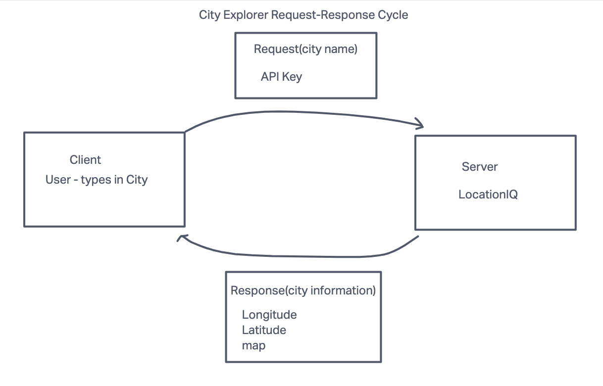

# PROJECT NAME

project description goes here.

## Getting Started

### Requirements

For development, you will only need Node.js installed on your environment.
And please use the appropriate [Editorconfig](http://editorconfig.org/) plugin for your Editor (not mandatory).

#### Node

[Node](http://nodejs.org/) is really easy to install & now include [NPM](https://npmjs.org/).
You should be able to run the following command after the installation procedure
below.

    $ node --version
    v0.10.24

    $ npm --version
    1.3.21

### Install

    git clone https://github.com/Arvoya/city-explorer
    cd PROJECT
    npm create @vite latest *REPO NAME*
    npm install

### Configure app

    npm install axios
    npm install react-bootstrap bootstrap

### Start & watch

    npm run dev
    npm start

### Simple build for production

    npm run build

## Architectur

### Languages & tools

* Javascript
* CSS
* HTML
* React
* Bootstrap
* Axios
* LocationIQ API

## Change Log

Name of feature: Set up your React repository & API keys

Estimate of time needed to complete: 20 min

Start time: 2:30

Finish time: 2:58

Actual time needed to complete: 28 min

---

Name of feature: Locations: As a user of City Explorer, I want to enter the name of a location so that I can see the exact latitude and longitude of that location.

Estimate of time needed to complete: 1 hour

Start time: 3:55pm

Finish time:

Actual time needed to complete:
