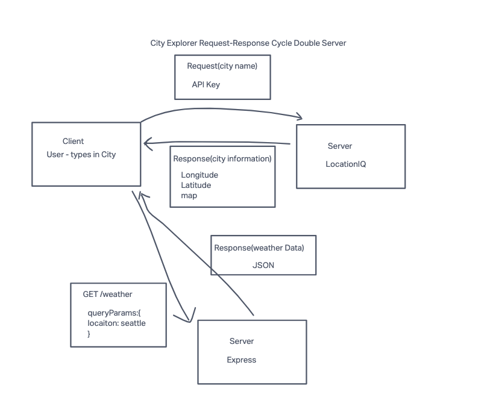
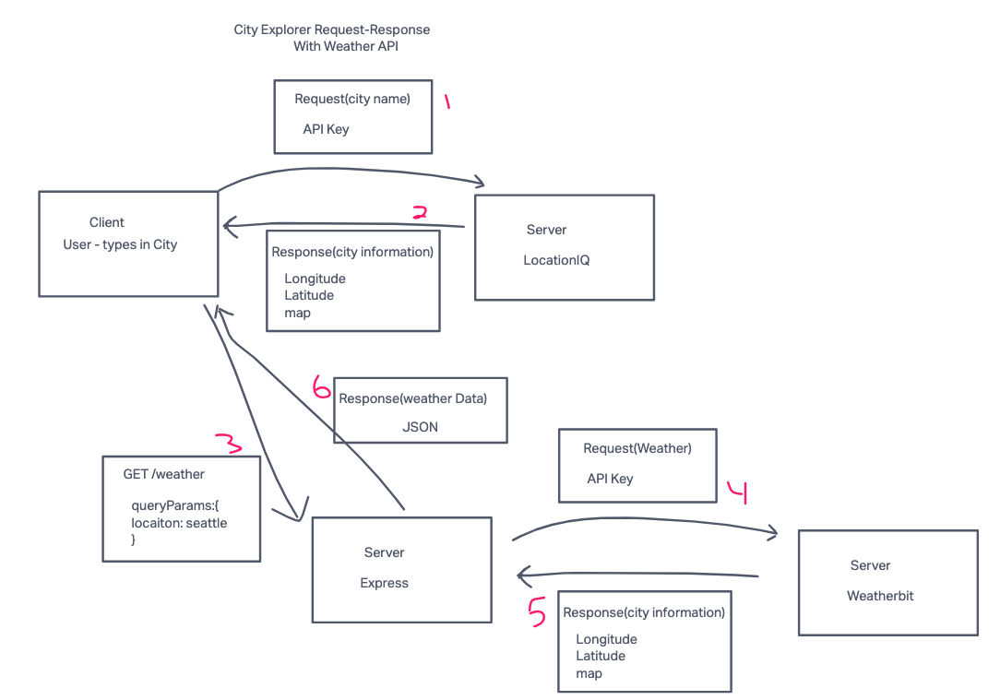

# City Explorer

A webapp to explore and discover details on various cities!

## Getting Started

### Requirements

For development, you will only need Node.js installed on your environment.
And please use the appropriate [Editorconfig](http://editorconfig.org/) plugin for your Editor (not mandatory).

#### Node

[Node](http://nodejs.org/) is really easy to install & now include [NPM](https://npmjs.org/).
You should be able to run the following command after the installation procedure
below.

    $ node --version
    v0.10.24

    $ npm --version
    1.3.21

### Install

    git clone https://github.com/Arvoya/city-explorer
    cd PROJECT
    npm create @vite latest *REPO NAME*
    npm install

### Configure app

    npm install axios
    npm install react-bootstrap bootstrap

### Start & watch

    npm run dev
    npm start

### Simple build for production

    npm run build

## Architecture

### Single Server - LocationIQ

### Double Server - Express Local API

### Triple Server - Weatherbit

### Languages & tools

* Javascript
* CSS
* HTML
* React
* Bootstrap
* Axios
* LocationIQ API
* Weatherbit API
* ExpressJS

## Change Log

## Change Log

01-17-2024 - Application now has a fully-functional express server, with a GET route for the weather(placeholder) resource. -->

01-19-2024 - Application can now display a forecast, but only through a local server connection.

## Feature Log

Set up your React repository & API keys

Estimate of time needed to complete: 20 min

Start time: 2:30

Finish time: 2:58

Actual time needed to complete: 28 min

---

Locations: As a user of City Explorer, I want to enter the name of a location so that I can see the exact latitude and longitude of that location.

Estimate of time needed to complete: 1 hour

Start time: 3:55pm

Finish time: 4:56pm

Actual time needed to complete: 1hour and 1 minute

---

Map: As a user, I want to see a map of the city so that I can see the layout of the area I want to explore.

Estimate of time needed to complete: 1 hour

Start time: 5:49pm

Finish time: 9:00pm

Actual time needed to complete: 3 hours 11 min

---

Errors: As a user, I want clear messages if something goes wrong, so I know if I need to make any changes or try again in a different manner.

Estimate of time needed to completer: 1 hour

Start time: 11:29am

Finish time: 12:20pm

Actual time needed to complete: 51 minutes

---

Weather (placeholder): As a user of City Explorer, I want to see weather info for the city I searched, so that I know how to pack for an upcoming trip.

Estimate of time needed to completer: 2hour

Start time: 6:32pm

Finish time: 12:20pm

Actual time needed to complete: 51 minutes

---

Errors (revisited): As a user, I want clear messages if something goes wrong, so I know if I need to make any changes or try again in a different manner.

Estimate of time needed to complete: 30 minutes

Start time: 10:57pm

Finish time: 11:19am

Actual time needed to complete: 22 minutes

---

Weather (Live) - As a user of City Explorer, I want ot see weather info for the city I searched, so that I know how to pack for an upcoming trip

Estimate of time needed to complete: 1 hour

Start time: 12:51pm

Finish time: 5:52pm

Actual time needed to complete: 5 hours 

---

Movies: As a user of City Explorer, I want to see info about movies related to the city I searched, so that I can learn more about the destination.

Estimate of time needed to complete: 1 hour

Start time: 6:42pm

Finish time: 10:22pm

Actual time needed to complete: 3 hours (lots of time refactoring)

---

Publish: Deploy your server. As a user, I want to access the City Explorer application on the web, so that anyone can explore from anywhere.

Estimate of time needed to complete: 1 hour

Start time: 4:45pm  

Finish time: 5:05pm 

Actual time needed to complete: 20 minutes

---

Refactor: Create components the front-end codebase

Estimate of time needed to complete: 1 hour

Start time: 3:46pm

Finish time: 

Actual time needed to complete: 
